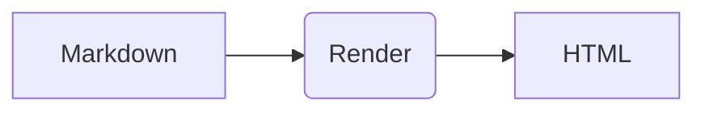

# Bienvenue

Ceci est un MVP « OntoWave ».

- Navigation: utilisez les liens markdown pour référencer d’autres pages.
- Exemple: [Page de démonstration](demo.md)

---

```mermaid
flowchart LR
  A[Markdown] --> B(Render)
  B --> C[HTML]
```

Formule KaTeX: $E = mc^2$.
